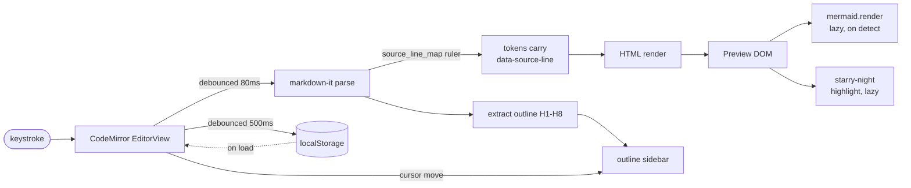

# Source-line mapping and reveal-counterpart

This is the browser editor's original idea, and the one piece of it worth
understanding even though that shell is frozen.

## The contract

A markdown-it core ruler named `source_line_map` attaches `data-source-line="N"`
(1-indexed) to the opening HTML element of every **block-level** token.

Covered: `paragraph_open`, `heading_open`, `blockquote_open`, `list_item_open`,
`bullet_list_open`, `ordered_list_open`, `table_open`, `fence`, `code_block`, `hr`,
`html_block`.

Not covered: inline elements. Emphasis, strong, links and inline code get no
attribute, because markdown-it's token maps are line-level and carry no column
information. Table cells therefore share their row's source line — an accepted
limitation, not an oversight.

## Reveal in both directions

**Editor → preview** (`cmd-shift-]`, and the right-click menu):

1. read the cursor line `N` from CodeMirror state
2. `document.querySelector('[data-source-line="<N>"]')`, ascending-scan to the
   nearest if the exact line is absent
3. `el.scrollIntoView({ block: 'center', behavior: 'smooth' })`
4. add `.gmd-flash-highlight` for 1200 ms

**Preview → editor** (right-click "Reveal in source"):

1. `target.closest('[data-source-line]')`, read the attribute
2. `view.dispatch({ selection: EditorSelection.cursor(view.state.doc.line(N).from), scrollIntoView: true })`
3. flash a CodeMirror line decoration for 1200 ms

Both directions fall back rather than fail. The mapping is sparse by construction,
so "nearest ancestor" and "nearest following line" are the normal path, not the
error path.

## The panes deliberately do not scroll together

There is no coupled scroll, and adding one would be a regression. The reasoning is
recorded in `docs/adr/0001-no-coupled-scroll-between-editor-and-preview.md`.

## The pipeline around it

Browser-mode persistence is one `localStorage` key holding the whole document,
written on a 500 ms debounce and read back when the `EditorView` is constructed.
The 5 MB cap is far above any markdown document this handles.

Any debounced reactive pipeline here — parse, save, format — needs its initial
value computed synchronously at `$state` init and wrapped in `untrack()`, or the
first paint is blank for the length of the debounce.

## The general rule

Line-level mapping is enough for navigation and never enough for synchronisation.
Build affordances that *jump on request* and they stay correct; build ones that
*track continuously* and soft wrap breaks them, because rendered height and raw
character height are not the same quantity.
