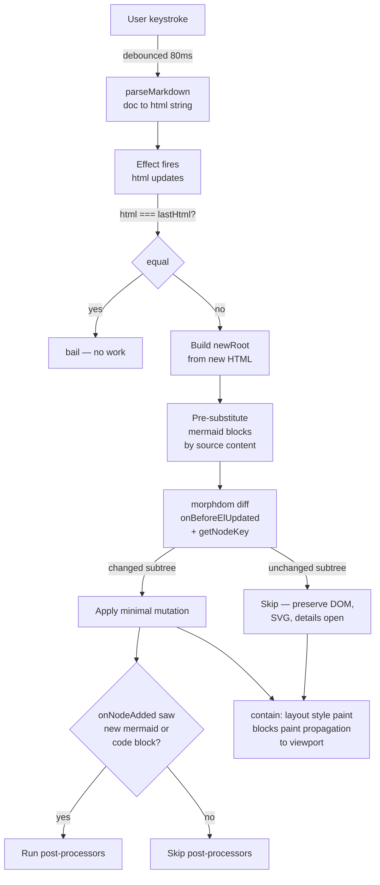

# v0.4.2 — The "stop the flicker" release

**TL;DR.** Three rapid drops (v0.4.0, v0.4.1, v0.4.2) landed sticky-scroll headers, GitHub-style alerts, distinct markdown syntax colors, markdown auto-pairs, and a smart-selection keymap — but the headline shipping is that typing in a long doc no longer causes the preview to flicker on every keystroke. The fix was a morphdom DOM-diff replacing the innerHTML clobber, plus CSS `contain: layout style paint` to isolate viewport paint, plus keying mermaid pre-substitution by source content (not line) so unchanged diagrams aren't re-rendered. v0.4.0 and v0.4.1 are intermediate tags; v0.4.2 is the line everyone should run.

## Why this release exists

User report on v0.3.0: "on editor if i typed something yes the right side will render but when the page content is long and scroll needed even if i pinned the view preview to that matching content am editing, each key stroke will shortly flicker the right side. sort of like it's trying to re render then re scroll to that content."

Three layered causes, each missed by the previous fix attempt:

1. **`innerHTML` wipe.** `localHost.innerHTML = html` on every keystroke tears down the entire preview subtree and rebuilds it. Even when 99% of the DOM is unchanged, the browser repaints everything. Fix: morphdom-based DOM diff.
2. **Paint propagation across the article.** Once morphdom shipped, the flicker MOVED — typing at the bottom of the editor flickered the TOP of the preview. Root cause: morphdom mutations in any descendant force the browser to repaint the entire scroll viewport unless paint is contained. Fix: `contain: layout style paint` on `.markdown-body`.
3. **Mermaid re-render keyed by source-line.** The pre-substitution map keyed the rendered `
` by `data-source-line`. Typing anywhere ABOVE the mermaid bumped its line number, the match failed, morphdom discarded the rendered SVG, and `processMermaid` re-rendered the diagram on every keystroke. The diagram's height oscillation was the most visible part of the remaining flicker (the user spotted this one). Fix: key by `data-mermaid-src` (source content), add `getNodeKey: mermaid:${src}` to morphdom so the match is positionally robust.

## Highlights

| What | Why it matters |
|---|---|
| **Sticky-header stack** at top of editor | Replaces the single-row breadcrumb from v0.3.0. VS Code-style: H1/H2/H3 each render as their own translucent sticky row, distinct heading colors. Click to jump. |
| **Distinct markdown syntax colors** | H1–H6 each get a different hue (red/blue/purple/orange/navy/brown); strong, emphasis, monospace, links all separable. Replaces CM6 `defaultHighlightStyle` which collapsed everything to similar shades. |
| **GitHub-flavored alerts** | `> [!NOTE]`, `[!TIP]`, `[!IMPORTANT]`, `[!WARNING]`, `[!CAUTION]` render with the same icon + color scheme as GitHub itself (`markdown-it-github-alerts`). |
| **Markdown auto-pairs** | Select text, type `` ` `` / `*` / `_` / `~` / `(` / `[` / `{` / `"` / `'` → selection is wrapped instead of replaced. VS Code parity. |
| **`Cmd/Ctrl+Shift+→`** | Expands the selection to the enclosing syntax node (markdown block, fenced code, list item). Wired via CM6's `selectParentSyntax`. |
| **`Alt+Z` word wrap toggle** | Persisted to `localStorage`. |
| **VS Code-style search panel** | CSS overrides on CM6's `.cm-search` — compact floating widget top-right instead of the wide horizontal band. |
| **Right-click reveal-counterpart on both panes** | Replaces the previous Cmd/Ctrl+click on editor + double-click on preview. Symmetric and discoverable. Native browser context menu suppressed unconditionally on the editor pane (CM6 handler + wrapper-level trap). |
| **`
` auto-expand on reveal** | When the matching preview block lives inside a closed `
`, the reveal handler walks up the ancestor chain, opens each closed details, then scrolls + flashes. |
| **Outline highlight skips collapsed sections** | `offsetParent === null` check skips headings inside closed `
` (`display:none`). Fixes the bug where scrolling past a collapsed multi-heading section made the outline highlight stick to a heading inside the closed block. |
| **`?` keyboard shortcuts dialog** | New `ShortcutsDialog.svelte`. Opens via `?` button in outline header or `?` keypress (outline focused). |
| **Fork-me GitHub icon** | Small octocat in the outline header next to `?` / `−` / `+` buttons. Links to source repo, opens in new tab. |
| **Preview flicker fix (the headline)** | morphdom + `contain: layout style paint` + source-content keying for mermaid blocks. See "Why this release exists" above. |

## How the flicker-fix pipeline works

The pipeline guarantees: morphdom doesn't touch unchanged subtrees, unchanged mermaid SVGs stay in place (matched by source content not line position), and any mutation that DOES happen is paint-contained inside `.markdown-body`.

## Before / after

**Before (v0.4.0 + earlier flicker-fix attempts):**
- Type a character anywhere in the editor → the mermaid diagram briefly shows raw source, then re-renders to SVG. Diagram height oscillates. Preview viewport jolts visibly on every keystroke. The effect is amplified when collapsed `
` sections are involved.

**After (v0.4.2):**
- Type any character → no visible change in the preview except the specific text being edited. Mermaid SVGs, code-block highlights, and `
` open state all survive across morphs. Scroll position stays pinned even when typing far away from the visible block.

## New keyboard shortcuts

| Pane | Keys | Action |
|---|---|---|
| Editor | Right-click | Flash matching block in preview (auto-expands collapsed `
`) |
| Editor | Cmd/Ctrl + F | Find / replace (VS Code-style floating panel) |
| Editor | Alt + Z | Toggle word wrap (persisted) |
| Editor | Cmd/Ctrl + Shift + → | Expand selection to enclosing syntax node |
| Editor | `` ` `` * _ ~ ( [ { " ' | Wrap selection (markdown auto-pair) |
| Preview | Right-click | Jump editor caret to the clicked block |
| Outline | ? | Open keyboard-shortcuts dialog |

## Files changed (v0.4.0 → v0.4.2)

| File | What changed |
|---|---|
| `src/components/Preview.svelte` | morphdom-based diff; `onBeforeElUpdated` preserves `
` + skips mermaid + skips highlighted code; `onNodeAdded` gates post-processors; `getNodeKey: mermaid:${src}` keys by source content; `contain: layout style paint` on `.markdown-body` |
| `src/components/Editor.svelte` | Compartment for line-wrap; `Alt+Z` keymap; `Mod-Shift-ArrowRight` → `selectParentSyntax`; `markdownAutoPair` input handler; custom HighlightStyle (H1-H6 distinct, strong/emphasis/monospace); contextmenu handler with unconditional `preventDefault`; VS Code-style search CSS overrides |
| `src/components/App.svelte` | Sticky-header stack (replaces single-row breadcrumb); `ShortcutsDialog` wire; `oncontextmenu` trap on `.editor-pane`; `MutationObserver` also watches `attributeFilter:['open']` to recompute active-heading on details toggle; `offsetParent === null` skip on the active-heading walk |
| `src/components/Outline.svelte` | `onHelp` prop + `?` button + `?` keybinding; GitHub octocat link |
| `src/components/ShortcutsDialog.svelte` | NEW — modal dialog with keyboard shortcut table |
| `src/lib/markdown.ts` | `markdown-it-github-alerts` plugin; `BLOCK_OPEN_TYPES` includes `alert_open` (plugin renames `blockquote_open`); html_block wrapper REMOVED (was breaking `
`) |
| `src/lib/reveal.ts` | `expandDetailsAncestors` walks up + opens closed `
` before scroll; `requestAnimationFrame` after open so scroll reads post-expansion geometry |
| `src/lib/mermaid.ts` | `wrap.dataset.mermaidSrc = code` for morphdom's source-content key |
| `src/lib/highlight.ts` | `block.dataset.snSource = text` saved before highlight so morphdom can skip unchanged blocks |
| `src/main.ts` | Imports `markdown-it-github-alerts` CSS files |
| `package.json` | New deps: `markdown-it-github-alerts`, `morphdom`. Version 0.4.2 |

[Compare v0.3.0 → v0.4.2](https://github.com/luutuankiet/gh-md-editor/compare/v0.3.0...v0.4.2)

## Hard truths

- The `data-source-line` attribute is a stable key for *static* markdown elements but a fragile key for anything mermaid-rendered. The fix (source-content key) only works because mermaid blocks have stable source. Future block types that re-render asynchronously will need the same treatment.
- `contain: layout style paint` carries small layout side-effects in edge cases (out-of-flow positioned descendants escaping the container). None observed in this codebase but worth knowing if the preview ever gets popovers or tooltips.
- v0.4.0 and v0.4.1 are intermediate tags shipped during the diagnosis. They are functional but v0.4.2 is the line that actually fixes the user-reported flicker. Skip the intermediates.

Live at https://luutuankiet.github.io/gh-md-editor/.
