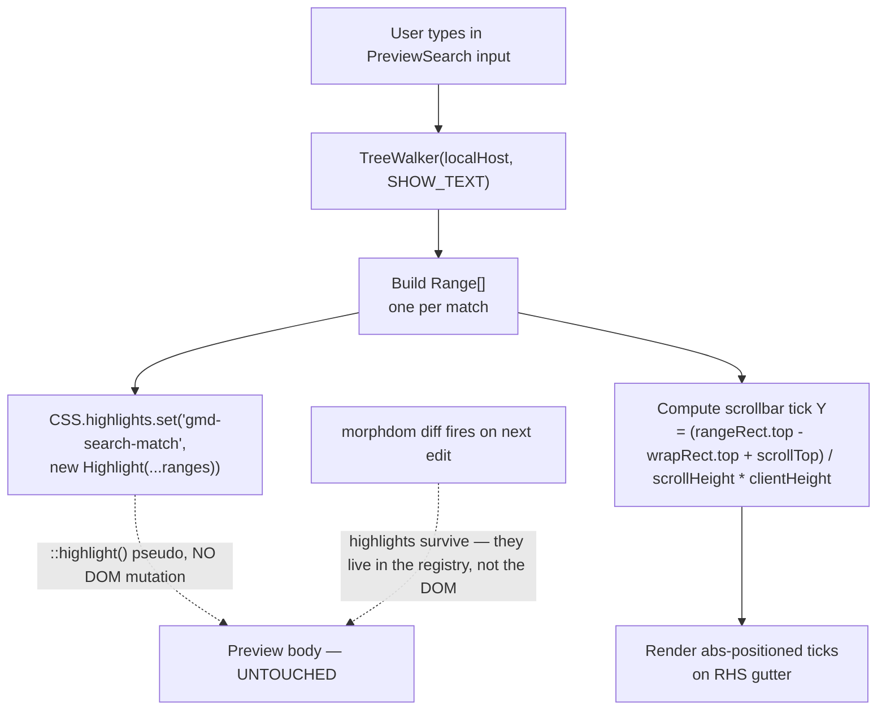
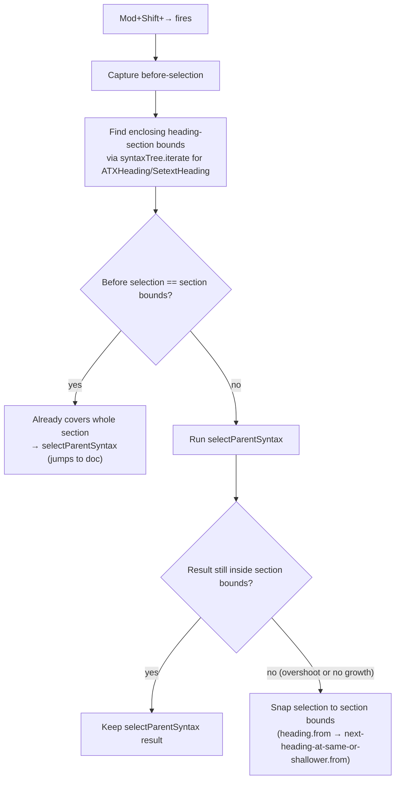

# v0.5.0 — Find in either pane, scrollbar ticks, and a sample doc that actually demos the thing

**TL;DR.** Cmd/Ctrl+F now works on both panes — floating overlay top-right, scrollbar match ticks on the right gutter, and click-on-a-word in the preview lights up matching occurrences in a fainter shade. The editor pane mirrors the same scrollbar-tick treatment for its native search and word-around-cursor. SQL fenced code blocks actually highlight now (they did not before, even though the grammar was installed). Mod+Shift+→ stops walking sideways out of a heading into the next block and instead clamps to the enclosing markdown section. Right-clicking inside a table flashes the matching ROW, not the whole table. Mac Firefox no longer pastes Ω when you press Opt+Z. And the initial sample doc is rewritten as an honest feature tour with a narrative TL;DR at the top — append `?reset=1` to the URL to load it back at any time.

## Why this release exists

User report after v0.4.2:

> let's focus on preview-pane search. add synergy for the scrollbar similar to vs code when i hit Cmd+F. when i type the word to search those scrollbar should have indicator where all the matches are. single click on a word or highlight should auto highlight matching similar to vs code, with different shades on the scrollbar. should have the same behavior for scrollbar for editor mode.
>
> and fix this weird bug on my mac opt+z it just pasted this key Ω and no word wrap happening.
>
> and bug on editor pane i dont think syntax code highlighting working on fenced code block at least for sql code it's all plain black rn.
>
> and ctrl shift right arrow ain't working as vs code should to select code block: yes if cursor on a fenced code block then the whole fence is selected, but if i arrow couple more time it does not select the whole markdown heading section's content. it keeps highlighting words succeeding its tail.
>
> and editor pane right click to flash preview content doesnt seem to flash if selected is a markdown table. code works mermaids work though.
>
> then brainstorm a good content for the initial open to demo all the cool feats!

Six asks, one release.

## Highlights

| What | Why it matters |
|---|---|
| **Preview Cmd/Ctrl+F overlay** | Floating panel top-right of the preview, mirrors the editor's CodeMirror search visually. Uses the CSS Custom Highlight API so it never modifies the morphdom-managed DOM (no flicker regression, no breaking the v0.4.2 paint-containment work). |
| **Scrollbar match ticks — both panes** | Right-edge gutter ticks for every match. Three layers: implicit (word-at-cursor / clicked word — faint blue), explicit (search query — yellow), current (the active match — accent orange). Same vocabulary on editor and preview. |
| **Click-word implicit highlight in preview** | Left-click any word → all occurrences light up faintly (different shade from the explicit search), with corresponding ticks on the scrollbar. Distinct from explicit Cmd+F search so both can coexist. `caretRangeFromPoint` / `caretPositionFromPoint` to extract the word at the click coordinate. |
| **SQL fenced code finally highlights** | The grammar (`@codemirror/lang-sql`) was already installed but never lit up because (a) the markdown plugin's lazy-load wasn't reliably re-decorating already-parsed fences, and (b) my custom `HighlightStyle` only had entries for markdown tags, so even when SQL tokens emitted `t.keyword` they had no color. Fix: pre-resolve common languages (SQL, TS, JS, Python, JSON, YAML, HTML, CSS) into `LanguageDescription.of({ support })` so the parser gets the inner language synchronously, AND extend `HighlightStyle` with explicit entries for `keyword`/`string`/`number`/`comment`/`operator`/etc. |
| **Mod+Shift+→ section-clamping** | `selectParentSyntax` walks Lezer's tree up. In flat markdown it eventually escapes the heading section and starts grabbing words past the tail of the section. v0.5.0 wraps it: find the enclosing heading-section bounds first; if `selectParentSyntax` overshoots those bounds OR doesn't grow at all, snap selection to the whole section (heading.from → next-heading-at-same-or-shallower-level.from). One more press from there resumes normal selectParentSyntax — typically jumping to the whole doc. |
| **Table-row reveal flash** | Added `tr_open` to `BLOCK_OPEN_TYPES` in `markdown.ts` so each table row gets a `data-source-line` attribute. The reveal walker already picks the nearest ancestor with that attribute, so right-clicking inside the editor on a table line now flashes the matching `<tr>` in the preview instead of the whole `<table>`. |
| **Mac Opt+Z word-wrap fix** | Firefox on macOS emits the composed character `Ω` for Alt+Z, and CodeMirror's `key: 'Alt-z'` matches against `event.key === 'z'` which never fires. Intercept at the DOM event level (`event.code === 'KeyZ' && event.altKey`) BEFORE CodeMirror's input handler converts the keystroke into a `Ω` character insertion. Linux/Windows path unchanged. |
| **Sample doc as feature tour** | First-open content rewritten: 4-paragraph narrative TL;DR (the "why this exists / drive it like VS Code / what it is NOT / persistence story") followed by section-by-section demos of every capability. Each section is the demo, not a description of the demo. |
| **`?reset=1` URL recovery** | Append to URL and reload to wipe the current localStorage draft and restore the v0.5.0 sample doc. Solves "how do I see the new feature tour when I already have a draft?". |

## How preview search routes around morphdom

The key choice: CSS Custom Highlight API instead of wrapping matches in `<mark>`. Wrapping would break morphdom's diff algorithm — every search-altered subtree would look "changed" on the next keystroke and trigger needless re-renders, undoing v0.4.2's flicker fix. Highlights live in `CSS.highlights` registry; the DOM stays clean.

## How Mod+Shift+→ clamps to heading sections

Net effect: the selection grows naturally up to the end of the current heading section, then snaps to cover the whole section, then jumps to the whole document. No more "why is it grabbing the start of the NEXT heading."

## SQL highlight — the diagnosis

Two silent failures stacked:

1. **Lazy lang resolution didn't re-decorate pre-existing fences.** `@codemirror/lang-markdown` accepts `codeLanguages: LanguageDescription[]` where each descriptor has a `.load()` returning `Promise<LanguageSupport>`. On encountering a fence with info string `sql`, the markdown plugin called `.load()`, awaited it, AND — in this stack — didn't reliably trigger a re-parse of the already-rendered fence. The fence stayed plain text from initial parse onward. **Fix:** pre-resolve common languages with `LanguageDescription.of({ name, support: sql() })`. When `support` is set, the markdown plugin returns the parser synchronously — first parse pass already has the inner grammar.

2. **Even after lang-sql loaded, every SQL token was rendered in default editor color.** My v0.4.x custom `HighlightStyle` covered markdown tags only (`heading1`-`heading6`, `strong`, `emphasis`, `monospace`, `link`, `url`, `meta`, `quote`, `list`). Nothing for `t.keyword`, `t.string`, `t.number`, etc. — the tags the SQL grammar emits. With no entry for those tags, the highlighter painted them in the default editor foreground color (`#1f2328`), indistinguishable from plain identifiers. **Fix:** extend `HighlightStyle` with explicit entries for the common nested-language tags using the GitHub palette (red for keywords, dark blue for strings, brighter blue for numbers, gray italic for comments, purple for function names, blue for type names, etc.).

Both fixes are required — either alone leaves the fence dark.

## Files changed

| File | What changed |
|---|---|
| `src/components/Editor.svelte` | Pre-resolved `LanguageDescription` array for SQL/TS/JS/Python/JSON/YAML/HTML/CSS, concatenated with `language-data` lazy descriptors for everything else. Extended `HighlightStyle` with nested-language tag entries (`keyword`, `string`, `number`, `comment`, `operator`, `propertyName`, `function(variableName)`, etc.). `EditorView.domEventHandlers.keydown` intercepts Mac Opt+Z BEFORE CM6's input handler. Custom `selectParentOrSection` command wired to `Mod-Shift-ArrowRight` — walks Lezer tree for the enclosing heading section, clamps growth to section bounds when selectParentSyntax overshoots. Scrollbar tick state (`matchTicks`, `implicitTicks`, `currentTickY`) populated via `updateListener.of(...)` reading `getSearchQuery` + `state.wordAt(cursor)`. ResizeObserver re-runs the tick math when the scroller geometry changes. |
| `src/components/Preview.svelte` | Wrapped scroll container in `
` (position:relative) to host the search overlay + tick rail as siblings to `.preview-wrap`. Mounted `<PreviewSearch>` inside. |
| `src/components/PreviewSearch.svelte` | NEW — search overlay UI + match computation via `TreeWalker(SHOW_TEXT)` + highlight application via CSS Custom Highlight API (`CSS.highlights.set(...)`) + scrollbar tick rail + click-word implicit highlight via `caretRangeFromPoint`/`caretPositionFromPoint`. Global Cmd/Ctrl+F handler that only fires when focus is NOT inside `.cm-editor` (lets the editor's own search panel keep its keyboard binding). |
| `src/components/App.svelte` | `sampleDoc()` rewritten: 4-paragraph narrative TL;DR, per-feature demo sections, SQL fenced code as part of the tour. |
| `src/components/ShortcutsDialog.svelte` | New rows for Preview Cmd+F, click-word implicit highlight, table-row reveal, the URL `?reset=1` recovery. |
| `src/lib/markdown.ts` | `tr_open` added to `BLOCK_OPEN_TYPES` so each table row gets `data-source-line`. The existing reveal walker (`reveal.ts`) already picks the nearest ancestor with that attribute, so right-click on a table line now flashes the matching `<tr>` rather than the whole `<table>`. |
| `src/lib/persistence.ts` | `?reset=1` URL flag forces `loadDoc()` to return `''` after wiping localStorage — the editor then falls through to `sampleDoc()`. |
| `package.json` | Version 0.5.0. Adds explicit deps for the pre-resolved languages: `@codemirror/lang-sql`, `lang-javascript`, `lang-python`, `lang-json`, `lang-yaml`, `lang-html`, `lang-css` (the first six were transitive via `language-data`; v0.5.0 surfaces them as direct deps because we import them eagerly). |

[Compare v0.4.2 → v0.5.0](https://github.com/luutuankiet/gh-md-editor/compare/v0.4.2...v0.5.0)

## Hard truths

- The CSS Custom Highlight API needs Firefox 140+ / Chrome 105+ / Safari 17.2+. Older browsers fall through silently — the tick rail still works but the in-text highlight does not. A `<mark>`-wrapping fallback is doable but conflicts with morphdom's diff key strategy from v0.4.2; deferring until someone files a real bug.
- Pre-resolving language modules ups the eager bundle by ~80-150 KB per language (gzipped, ~30-50 KB transferred). v0.5.0 trades initial-load size for guaranteed first-paint highlight on common languages. Go / Rust / Java / etc. stay lazy via `language-data` descriptors.
- The implicit click-word highlight matches by exact substring (case-sensitive byte-equivalence after lowercase). It does not respect identifier boundaries inside code blocks — clicking `last` inside `last_seen` highlights every `last` everywhere. Improvement deferred to v0.5.x when there's a real reason to special-case the in-code path.
- Mac Opt+Z fix relies on `event.code === 'KeyZ'` which is keyboard-layout-stable. Users on layouts where Opt+Z produces something other than Ω are unaffected (the keydown still has `code === 'KeyZ'`).
- `?reset=1` removes the user's draft. The flag is intentional and one-shot — documented in the new sample doc's TL;DR, the new shortcuts dialog row, and this release. No confirm dialog because the draft is in localStorage and the user is appending the flag themselves.

Live at https://luutuankiet.github.io/gh-md-editor/.
