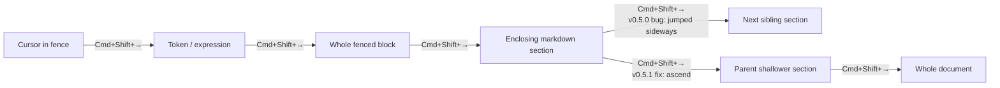

# v0.5.1 — Preview sticky-header parity, multi-cursor, scrollbar you can actually see

## TL;DR

v0.5.0 shipped seven features but left behind seven paper cuts. This release closes them and adds the one VS Code feature people kept asking for: **multi-cursor**.

- **Preview pane gets the sticky-header stack** that the editor pane has had since v0.4. Scrolling either pane now keeps the heading hierarchy pinned at the top.
- **Multi-cursor lands.** `Cmd/Ctrl+D` adds a caret at the next match. `Alt/Opt + Left-click` drops one wherever you point. VS Code muscle memory ports directly.
- **Selection-growth ascend fix.** v0.5.0's `Cmd+Shift+→` clamped to a section then walked SIDEWAYS into the next sibling. v0.5.1 ascends to the enclosing parent section instead, then to the whole document.
- **Ctrl+Shift+→ on Mac** — same command as Cmd+Shift+→. Whichever modifier your fingers reach for, it fires.
- **Outline auto-expands** when scrolling moves the active heading into a collapsed branch. No more hunting through closed nodes to find where the highlight went.
- **Trash button in the outline header.** Wipes localStorage and reloads with a confirm prompt. The `?reset=1` URL trick still works.
- **Scrollbar gutters bumped 12 px → 18 px.** The v0.5.0 match-tick rail existed in theory; now you can actually see it.
- **Shortcuts dialog highlights the VS Code muscle-memory bindings** with an accent stripe and a `VS Code` badge. Preview `Cmd+F`, editor `Alt+Z`, `Cmd+D`, `Alt+Click` — the bindings that port directly from `code`.
- **Sample doc rewritten.** Right-click reveal is now framed as the novel feature it is (every other side-by-side markdown editor refuses to do this). Multi-cursor + clear-storage walkthrough added.

## Why this release exists

v0.5.0 was a feature bundle. It worked but landed with rough edges:

1. The 12 px scrollbar gutter and 8 px ticks were technically present but visually invisible — the headline scrollbar-match-ticks feature was undersold by its own geometry.
2. `Cmd+Shift+→` clamping to a markdown section was correct on the first press, then bugged on the second: instead of ascending to the parent, it walked sideways. Reported on the very first hands-on test.
3. Outline tracking was beautiful when scrolling through expanded headings and useless when scrolling into a collapsed branch — the active highlight just vanished.
4. The sample doc described the editor's capabilities. It did NOT pitch the one feature that justified the editor's existence in the first place: bidirectional right-click reveal.
5. The only way to get the sample doc back was `?reset=1` in the URL. Discoverable for power users, not for anyone else.
6. Sticky breadcrumb on the editor pane was a quiet win, but the preview pane — the side where you actually *read* — got nothing.
7. The shortcuts dialog listed every binding flat. The bindings that ported from VS Code muscle memory (preview `Cmd+F`, `Alt+Z`) deserved a visual call-out, not an alphabetical buried entry.

And then, two minutes into the v0.5.0 demo, the question came back: "can it do multi-cursor?" Of course it can — CodeMirror has the primitives. v0.5.0 didn't enable them. v0.5.1 does.

## Highlights

| Area | Change | Why it matters |
|---|---|---|
| Multi-cursor | `EditorState.allowMultipleSelections.of(true)` flips the switch | `Cmd+D` (selectNextOccurrence) and `Alt+Click` now spawn cursors. Type once, type everywhere. |
| Preview sticky-header | `previewBreadcrumb` derived from `activeHeadingLine` | The reading pane finally answers "where am I?" the same way the editor pane does. |
| Section-grow ascend | New `findEnclosingSectionBounds()` walks Lezer tree for a shallower-level heading | Press `Cmd+Shift+→` past the section bounds → the PARENT section selects, not the next sibling. |
| Ctrl+Shift+→ on Mac | Literal `Ctrl-Shift-ArrowRight` key binding added next to existing `Mod-Shift-ArrowRight` | Mac users with VS Code Ctrl muscle memory hit the same command. |
| Outline auto-expand | `$effect` watches `activeAncestors`, force-opens any folded line containing it | Active row stays visible regardless of fold state. |
| Clear-storage button | New `clearDoc()` in `persistence.ts` + trash icon in `Outline.svelte` header | Confirmation-gated wipe + reload. Restores the sample doc without typing URL parameters. |
| Scrollbar gutter | `.editor-tick-rail` / `.preview-tick-rail` width 12 px → 18 px; ticks 8 px → 14 px; current 10 px → 16 px | The feature that existed in v0.5.0 is now visible in v0.5.1. |
| Shortcuts dialog | `highlight?: boolean` flag on rows + accent stripe + `VS Code` badge | The muscle-memory ports are flagged as such. New `Cmd+D` and `Alt+Click` rows added. |
| Sample doc | Right-click framed as NOVEL FEATURE up front; multi-cursor + trash icon + sticky-preview parity all walked through | The pitch lives in the document, not in the README. |

## How section-grow ascends now

The key insight: once selection equals current section bounds, the old code fell back to CodeMirror's `selectParentSyntax`, which walks the Lezer tree to the next syntactic parent — in flat markdown, that's the next sibling block, not the enclosing heading. v0.5.1 short-circuits: when bounds already match, find a heading at level &lt; current level walking backward through the tree, and clamp to ITS bounds.

## Before / After: preview pane navigation

**Before (v0.5.0):** Editor pane had a sticky breadcrumb stack at the top showing `H1 → H2 → H3`. Preview pane had nothing. Scroll the preview into a 500-line document and the only context was the rendered heading itself, if it happened to be on screen.

**After (v0.5.1):** Both panes stack the heading hierarchy at the top. The preview's stack is driven by `activeHeadingLine` (already tracked since v0.4 for outline highlighting) — lifted into a `previewBreadcrumb` derivation, passed into `Preview.svelte` as a prop, rendered with the same accent CSS as the editor's stack. Click any row to jump.

## Before / After: multi-cursor

**Before:** `Cmd+D` did nothing. `Alt+Click` placed the SINGLE cursor at the click point and replaced the existing selection.

**After:** One-line extension addition flips it: `EditorState.allowMultipleSelections.of(true)`. `searchKeymap` already bound `Mod-d` to `selectNextOccurrence`; `drawSelection` already knew how to render multiple selections AND how to add a cursor on Alt-click. The pieces were all there; the flag was off.

## Files changed

| Path | Change |
|---|---|
| `src/components/Editor.svelte` | `allowMultipleSelections` extension; `Ctrl-Shift-ArrowRight` binding; `findEnclosingSectionBounds()` helper; `selectParentOrSection` rewrite for ascend; scrollbar CSS widened |
| `src/components/PreviewSearch.svelte` | Scrollbar CSS widened to match editor pane |
| `src/components/Preview.svelte` | `breadcrumb` + `onHeaderJump` props; sticky-header stack markup; sticky-header CSS (light + dark) |
| `src/components/Outline.svelte` | `onClear` prop; trash icon button; `$effect` for active-ancestor auto-expand |
| `src/components/App.svelte` | `clearDoc` import; `previewScrollTop` state; `previewBreadcrumb` derivation; scroll listener captures scrollTop; wired props to Preview + Outline; sampleDoc rewritten |
| `src/components/ShortcutsDialog.svelte` | `highlight?: boolean` flag on `Shortcut`; new `Cmd+D` + `Alt+Click` + `Trash icon` rows; tr.highlight CSS with accent stripe + `VS Code` badge |
| `src/lib/persistence.ts` | New `clearDoc()` with confirm + reload |

## Hard truths

- **Alt+Click multi-cursor on macOS Firefox MIGHT still emit `Ω` for Opt+Z** because the v0.5.0 fix targets `event.code === 'KeyZ'` at the DOM event level — verify on physical Mac. Headless verification path doesn't exist for native modifier keys.
- **The sticky-header stack on the preview pane sits over the rendered markdown**, including any inline-styled `<h*>` margins. There's a slight overlap on the first ≈20 px of content if the user scrolls precisely such that a non-heading paragraph is right under the stack. Acceptable for now — the pane is `position: relative` and reusing the editor's CSS pattern would force a layout-level rework.
- **`clearDoc()` uses `window.confirm()`** — native browser dialog, ugly, blocks the page. A nicer modal would need design work for a 1-shot interaction. Tabling.
- **Outline auto-expand fires from `$effect` triggered by `activeAncestors`** which is `$derived` on `activeLine`. This means scroll-driven auto-expansion happens BUT user-explicit folds may get clobbered if the user folds a node WHILE scrolling lands the highlight inside it. Trade-off accepted: scroll-driven UX wins over manual fold persistence.
